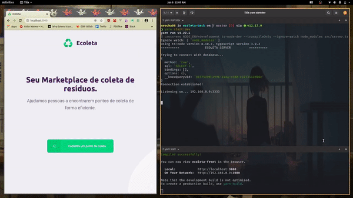
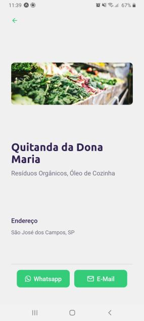
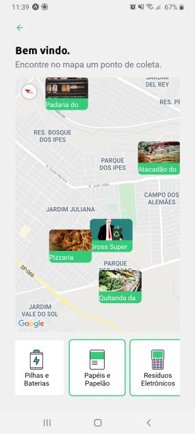

# Ecoleta ♻️🚀 (Mobile)


Um marketplace de coleta de resíduos. Desenvolvido na primeira edição da Next Level Week da Rocketseat.

## 💼 Projeto

O Ecoleta foi criado durante a [Semana Mundial do Meio Ambiente (IBEW)](https://www.ibew.sg/), e tem como finalidade divulgar pontos de coleta de resíduos, como por exemplo, óleo de cozinha, pilhas, lâmpadas, e etc.

Confira uma prévia:

🌐 Web:



📱Mobile:




Para o mobile, foi utilizado:

- Typescript
- React Native
- Expo

## ⚙ Como rodar o front-end

Antes de tudo, instale configure o [back-end](https://github.com/mrocha98/ecoleta-back/blob/master/README.md#-como-rodar-o-back-end).

Depois, instale o expo:

```bash
yarn global add expo-cli
```

Em seguida, execute os comandos:

```bash
git clone https://github.com/mrocha98/ecoleta-mobile #clona o repositório para sua máquina
cd ecoleta-mobile #entra no diretório do repositório
yarn install #instala as dependências
yarn start #executa a aplicação em modo de desenvolvimento
```

Diferente do front-end, **aqui há um arquivo .env**, certifique-se de configurá-lo. Consulte o arquivo [.env.example](https://github.com/mrocha98/ecoleta-mobile/blob/master/.env.example).

Se tudo ocorreu bem, seu navegador padrão abrirá uma nova guia com a tela de logs do Expo. Basta baixar o app do Expo em seu celular e apontar a câmera pro QR code.

## 🚫 Deploy

Diferente do back-end e do front-env, não foi possível realizar o deploy do mobile, pois isso requer uma conta de desenvolvedor nas principais lojas de apps, algo que não possuo no momento...

## 📜 Licença

Este projeto foi construído sob a licença BSD 2-Clause.
Clique [aqui](https://github.com/mrocha98/ecoleta-front/blob/master/LICENSE) para conferir mais detalhes.
